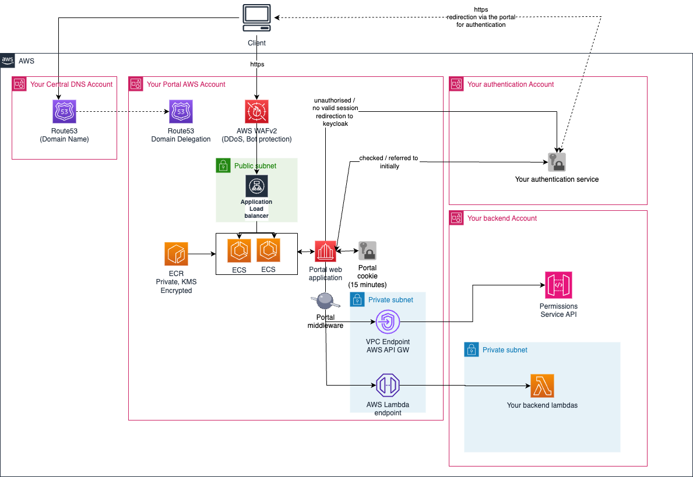

# Portal

This repository manages and creates the resources for the portal for the SDE platform.

> This repository is currently **not** accepting open source contributions. If you discover any serious issues, please contact england.sdeplatform@nhs.net

### Repository Overview

### File structure

```
.
├── portal (Contains the Next.js code for the website)
├── scripts (contains individual scripts for running locally or on the CI pipeline)
├── src
│   └── aws-lambda (contains the code for our lambda functions)
│   └── docker (contains the code for our docker images that run Cypress tests)
└── terraform
    ├── modules (contains our reusable terraform modules)
    ├── root_modules (contain the base modules for each terraform layer)
    ├── shared (contain shared variable definition and local variable files)
    └── vars (contain the variable files that define the parameters for each environment)
```

### Architecture

The aim of this repository is to create a web portal for the Secure Data Environment (SDE). SDE Portal is the webpage that users first interact with when entering SDE.

To do this, we build & store the portal docker image in ECR and then deploy the website on ECS fronted by a load-balancer.

The portal will make attempt to authenticate the user against your authentication service (e.g. keycloak)

Below you can see the architecture diagram:



## Local setup

The easiest way to set up your local dev env is to use asdf. After getting it set up, you can add the plugins for each tool listed in .tool-versions, and then run `asdf install` to install the correct versions. From then, any commands requiring those tools will use the correct versions. See https://asdf-vm.com/ for more instructions.

You must also have AWS configured for the relevant account.

There may also be other command line utilities that are needed. Please look out for bash warnings about missing tools.

Note: our code is designed to run on bash (including inside WSL). Other OS may not work.

### Pre-commit install

Installation steps can be found here https://pre-commit.com/

```
./scripts/git_secrets_download.sh
sudo ./scripts/git_secrets_install.sh
```

then either

```
pip install pre-commit
pre-commit install
```

or

```
brew install pre-commit
pre-commit install
```

## How to run, configure and deploy this repository

1. **Create an S3 bucket and DynamoDB table for your terraform state**

    The bucket and the table must have the same name. There should be one bucket & table for each environment.
    Once these are created, replace them in the `init` and `init-upgrade` targets in the makefile.

2. **Setup Git Submodules**
   In the root of the repo, create file called `.gitmodules`
   Within that file, specify contents as follows

```
[submodule "submodules/s3_to_cloudwatch_lambda"]
path = submodules/s3_to_cloudwatch_lambda
url = https://github.com/NHSDigital/cdp-tf-module-s3-to-cloudwatch-lambda.git
[submodule "submodules/s3_bucket"]
path = submodules/s3_bucket
url = https://github.com/NHSDigital/cdp-tf-module-s3-bucket.git
```

3. **Update NHS Emails/Phone Numbers**

    Before building and packaging the source code, update the NHS emails/phone numbers to your organisation's equivalent in the following files in the repo:

    | File                                                                                |
    | ----------------------------------------------------------------------------------- |
    | portal/app/agreement/[agreement_id]/manage-users/add-user/confirm/confirmView.tsx   |
    | portal/app/agreement/[agreement_id]/manage-users/add-user/confirm/confirmClient.tsx |
    | portal/app/agreement/[agreement_id]/manage-users/user/[user]/page.tsx               |
    | portal/app/induction/not-passed/page.tsx                                            |
    | portal/app/induction/passed/page.tsx                                                |
    | portal/app/induction/page.tsx                                                       |
    | portal/app/maintenance/page.tsx                                                     |
    | portal/app/403.tsx                                                                  |
    | portal/app/error.tsx                                                                |
    | portal/app/global-error.tsx                                                         |
    | portal/app/not-found.tsx                                                            |
    | portal/pages/agreement/[agreement_id]/fileupload.tsx                                |
    | portal/pages/agreement/[agreement_id]/fileuploadsuccess.tsx                         |
    | portal/pages/404.tsx                                                                |
    | portal/pages/405.tsx                                                                |
    | portal/pages/500.tsx                                                                |
    | portal/pages/welcome.tsx                                                            |
    | src/aws-lambda/data_in_forwarder/data_in_forwarder/templates/failure.html           |
    | src/aws-lambda/data_in_forwarder/data_in_forwarder/templates/success.html           |
    | src/aws-lambda/data_in_forwarder/data_in_forwarder/data_in_forwarder.py             |

4. **Package the lambdas**

    First, install the poetry pre-requisites by running the command `apt-get update && apt-get install -y make zip curl` and then `pip install -Iv poetry==$POETRY_VERSION`. Refer to the asdf tool versions file for versions of Poetry and other tools.

    The lambdas can be packaged by running the command `make lambda-package`.

5. **Push the portal website Docker Image to ECR**

    In this step, we will compile the Next.js website and then put this inside a Docker image.
    We will then push this to ECR.

    After configuring your AWS CLI to use the correct AWS environment, run:

    ```
    export IMAGE_TAG=$(git rev-parse --short=8 HEAD)
    export AWS_ACCOUNT_ID=$(aws sts get-caller-identity --query Account --output text)
    export IMAGE_NAME=${AWS_ACCOUNT_ID}.dkr.ecr.eu-west-2.amazonaws.com/portal:${IMAGE_TAG}
    docker build -t ${IMAGE_NAME} portal/
    docker push ${IMAGE_NAME}
    ```

6. **Create the tfvars file**

    You need to create some tfvars files in [the variables folder](./terraform/vars/). `common.tfvars` must exist, and is a tfvars file that is loaded for all your environments. Then for each environment you want to create (dev, test, int, prod, beta, whatever you want to call your environment) you must create a file with the environment name as the file name + `.tfvars`.

    You must populate these files with your own custom values. You can find the descriptions of the variables in [the variables file](./terraform/shared/variables.tf).

    - [Example Common Variables File](./terraform/vars/example_common.tfvars)
    - [Example Environment Variables File](./terraform/vars/example.tfvars)

7. **Run the deploy commands**

    - Set the env var `AWS_PROFILE` to the correct profile for the account you're deploying to
    - Set the env var `BUILD_ENV` to your build environment (dev, test, int, prod, etc)
    - Our terraform is split into layers, you can find the names of the layers by looking in [the root modules folder](./terraform/root_modules/) at the subfolder names (each subfolder is one layer). You can set the environment variable `MODULE` to the layer name to choose which layer to work with. You will need to do the plan/deploy steps mentioned below for each layer separately, deploying lower layers first.
    - You can run `make plan` once all the env vars are set to do a terraform plan
    - You can run `make deploy` to do a terraform deploy
